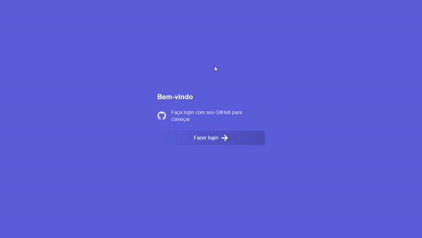

<h1 align = "center">
Pomodore
</h1>
<h4 align="center">
  <p align = "center">Aplicação que implementa a técnica de estudo Pomodoro 📖 📝<p/> 
</h4>
<p align = "center">
  
</p>
</br>
<p align = "center">
  


[](https://www.linkedin.com/in/adriano-costa-101395141/)
</p>
 


## :rocket: Tecnologias
Neste projeto foram implementadas as tecnologias:

-  [React](https://facebook.github.io/react/) Uma biblioteca JavaScript para construção de interfaces.
-  [NextJS](https://nextjs.org/)
-  [NextAuth](https://github.com/nextauthjs/next-auth) NextAuth.js é uma solução de autenticação de código aberto para aplicativos Next.js

## 🔓 Autenticação

 Para a autenticação com o GitHub foi utilizado o [NextAuth](https://next-auth.js.org/), que tambem fornece outros [provedores](https://next-auth.js.org/configuration/providers) de autenticação. Para testar a autenticação você precisa criar um [aplicativo OAuth](https://docs.github.com/pt/developers/apps/building-oauth-apps), que vai gerar um ClientId e um ClientSecret.

```javascript "
import Providers from `next-auth/providers`
...
providers: [
  Providers.GitHub({
    clientId: process.env.GITHUB_CLIENT_ID,
    clientSecret: process.env.GITHUB_CLIENT_SECRET
  })
]
...

```
## :information_source: Como usar

Para testar o projeto:

```bash
# Clone this repository
$ git clone https://github.com/AdrianoCostaJHP/react-pomodore.git

# Go into the repository
$ cd react-pomodore

# Install dependencies
$ yarn

# Run the app 
$ yarn dev

#open it in the browser on port 3000
http://localhost:3000
```

## :memo: Licença
Este projeto esta sob a licença do MIT.

---

Feito por Adriano Costa 💻♥ [Entrar em contato!](https://www.linkedin.com/in/adriano-costa-101395141/)
